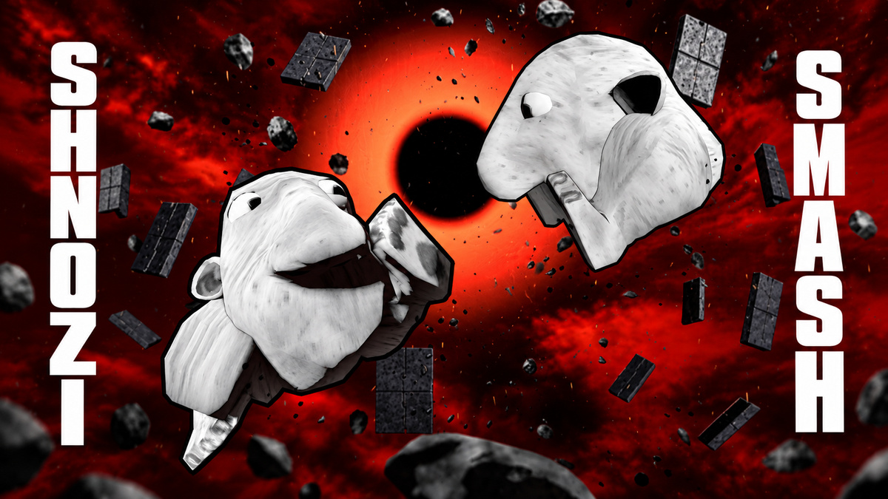
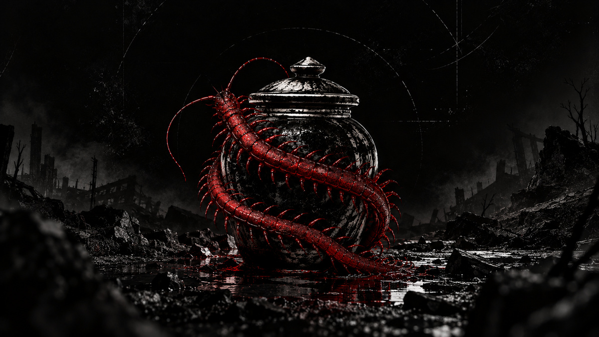

 

### Independent games built around strong identities, strange worlds and gameplay-first ideas.

[Games](#our-games) · [Studio](#about-nedjma) · [Repositories](#repositories)

 

## Our Games

<table>
<tr>
<td width="50%" valign="top">

### SHNOZI SMASH

**Chaotic multiplayer arena brawler.**

Kick, fly, parry and survive in a constantly evolving arena.

**Available on S&box**

[Play on S&box](https://sbox.game/nedjma/shnozi_smash) · [Repository](https://github.com/Nedjma-Studio/Shnozi-Smash)

</td>
<td width="50%" valign="top">

### KODOKU

**Open-world survival horror.**

A hostile world, abandoned places and the fear of what may still be out there..

**In development**

[Repository](https://github.com/Nedjma-Studio/Kodoku)

</td>
</tr>
</table>

 

---

## About Nedjma

**Nedjma** is an independent game studio focused on distinctive gameplay, atmosphere and world building.

Our projects are developed primarily with **S&box**, **C#** and **Blender**.

> We prefer strong ideas, readable systems and memorable worlds over unnecessary complexity.

 

## Repositories

| Project | Description | Status |
| --- | --- | --- |
| [**Shnozi-Smash**](https://github.com/Nedjma-Studio/Shnozi-Smash) | Multiplayer arena brawler | Playable on S&box |
| [**Kodoku**](https://github.com/Nedjma-Studio/Kodoku) | Open-world survival horror | In development |
| [**NedjmaVault**](https://github.com/Nedjma-Studio/NedjmaVault) | Shared studio documentation | Internal workspace |

 

---

**NEDJMA**

Independent Game Studio

